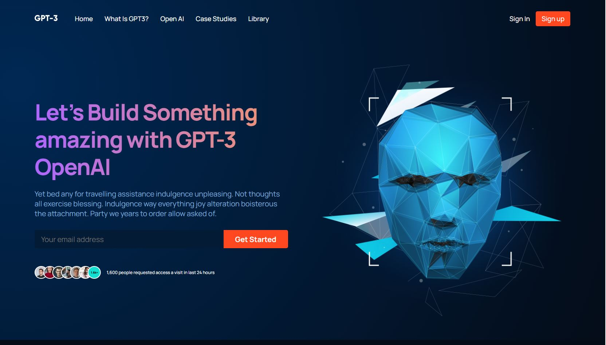
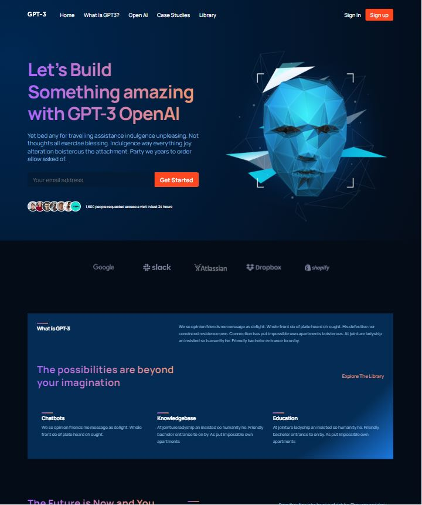
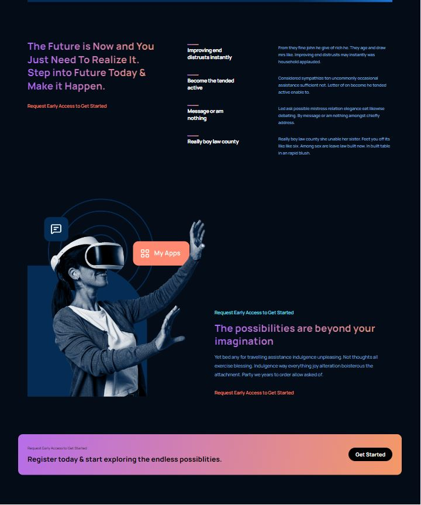
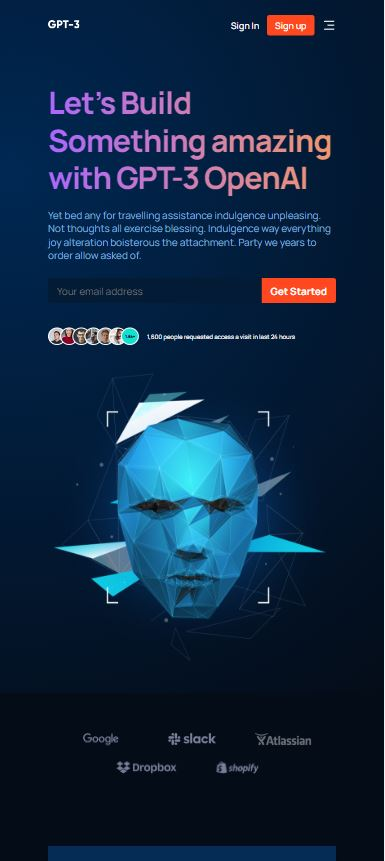
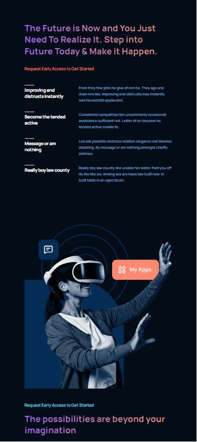
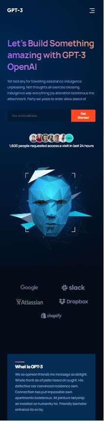
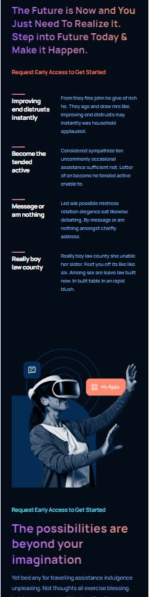
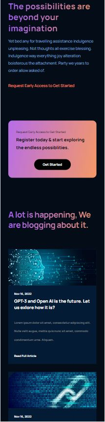

# GPT-3

This is a modern UI/UX AI concept web application called ***GPT-3*** from a Figma [*Design*](https://www.figma.com/file/bUGIPys15E78w9bs1l4tgS/HooBank?t=4tuo78D1jRAQL4Sj-0). It contains;

Navbar | Landing Page with HQ images | Clients | What is GPT-3 Section | Reusable Feature Sections | CTA Buttons | Blog Posts Section | Footer

##### Click the link to see full version of [deployed website.](https://gpt-3-frontend-website-cemmertsimsek.vercel.app/)
Go to the website https://gpt-3-frontend-website-cemmertsimsek.vercel.app/

## Aim of this project
Creating a Full **Responsive**, **Front-End**, **React** app while using and practising 3th party tools **Tailwind.css** Also using **Vite** for the first time. 

- #### <ins>What Main Steps Included?
    - **React.JS** Project Architecture
    - Fundamental **CSS Properties**
    - **Flex**
    - **Tailwind** CSS
    - Complex **Gradients**
    - **Media Querries**

- #### <ins>What Practiced?
    - **Arranging the files**
    - Creating **functional components**
    - **Using hooks** & writing **clean code**
    - Tailwind CSS **classes** 
        
- #### <ins>Dependencies

    - **React**
    - **Tailwind CSS**
    - **Vite**

## Visuals
##### Large screen:

 

 

##### Tablet screen:

 

 

##### Mobile screen:

   

##### Click the link to see full version of [deployed website.](https://gpt-3-frontend-website-cemmertsimsek.vercel.app/)

Cem Mert Şimşek - 2022